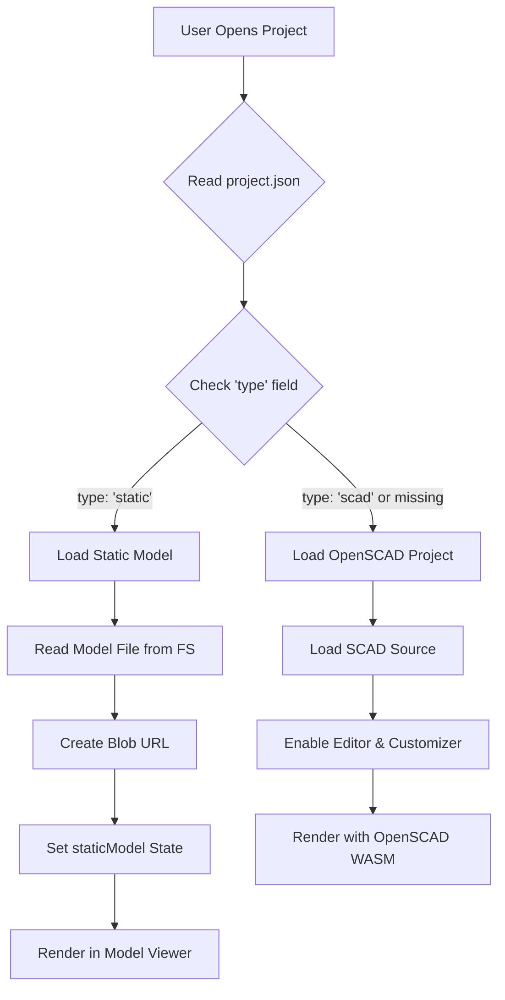
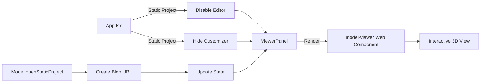

# Static Model Rendering - Visual Guide

## How It Works

### Model Type Detection Flow



### Component Integration



## UI States

### OpenSCAD Project
```
┌─────────────────────────────────────┐
│ [Editor] [Viewer] [Customizer]     │ ← All tabs visible
├─────────────────────────────────────┤
│                                     │
│  Code Editor    │    3D Viewer     │ ← Split view
│  with Monaco    │    with Model    │
│                 │    Viewer         │
│                                     │
├─────────────────────────────────────┤
│ [Render] [Export] [Gallery]        │ ← Full controls
└─────────────────────────────────────┘
```

### Static Model Project
```
┌─────────────────────────────────────┐
│ [Viewer]                            │ ← Only viewer tab
├─────────────────────────────────────┤
│                                     │
│         3D Model Viewer             │ ← Full screen
│         (GLTF/GLB/STL)             │
│         with AR support             │
│                                     │
├─────────────────────────────────────┤
│ [Gallery]                           │ ← Limited controls
└─────────────────────────────────────┘
```

## Gallery View

### Project Cards

Both static and OpenSCAD projects appear in the same gallery with type indicators:

```
┌─────────────────┐  ┌─────────────────┐  ┌─────────────────┐
│   [Thumbnail]   │  │   [Thumbnail]   │  │   [Thumbnail]   │
│                 │  │                 │  │                 │
├─────────────────┤  ├─────────────────┤  ├─────────────────┤
│ OpenSCAD Model  │  │ Static Model    │  │ OpenSCAD Model  │
│ [SCAD] Category │  │ [STATIC] Demo   │  │ [SCAD] Examples │
│                 │  │                 │  │                 │
│ Description...  │  │ GLTF format...  │  │ Description...  │
│                 │  │                 │  │                 │
│ #tag1 #tag2     │  │ #static #demo   │  │ #tag1 #tag2     │
└─────────────────┘  └─────────────────┘  └─────────────────┘
```

## Supported Formats Comparison

| Format | Size | Features | Best For |
|--------|------|----------|----------|
| GLTF | Medium | ✓ Animations<br>✓ Materials<br>✓ Textures<br>✓ PBR | Complex models with materials |
| GLB | Small | ✓ Animations<br>✓ Materials<br>✓ Textures<br>✓ PBR<br>✓ Binary | Production deployment |
| STL | Large | ✗ Materials<br>✗ Colors | 3D printing |
| OBJ | Large | ~ Materials<br>~ Textures | Legacy models |

## Example Use Cases

### 1. Showcase Pre-rendered Complex Models
```
Use Case: Display a highly detailed model that's too complex to render in real-time
Format: GLB with textures and materials
Benefits: 
  - Instant loading
  - Professional appearance
  - AR preview capability
```

### 2. Share External CAD Designs
```
Use Case: Import models created in Blender, Fusion 360, etc.
Format: GLTF/GLB exported from CAD software
Benefits:
  - No OpenSCAD conversion needed
  - Preserves original materials
  - Maintains design fidelity
```

### 3. Compare Render Results
```
Use Case: Show "before/after" or different render engines
Format: Multiple static model projects
Benefits:
  - Side-by-side comparison
  - Consistent viewer controls
  - Easy navigation between versions
```

## Adding Your Own Static Model

### Quick Start Guide

1. **Export your model** to GLTF/GLB format
2. **Create a project directory**:
   ```bash
   mkdir "Models/My Model"
   ```

3. **Add your model file**:
   ```bash
   cp my-model.gltf "Models/My Model/model.gltf"
   ```

4. **Create project.json**:
   ```json
   {
     "title": "My Model",
     "entry": "model.gltf",
     "type": "static",
     "description": "My awesome 3D model",
     "category": "Custom",
     "tags": ["custom", "demo"]
   }
   ```

5. **Rebuild libraries**:
   ```bash
   npm run build:libs
   ```

6. **View in gallery**:
   Navigate to the gallery and find your model!

## Technical Notes

### Blob URL Management
- Static models use `URL.createObjectURL()` for efficient rendering
- URLs are automatically revoked when switching projects
- No server requests after initial filesystem load

### Performance
- Static models load instantly (already rendered)
- No WASM compilation or rendering overhead
- Ideal for mobile devices and low-power systems

### File System Integration
- Models are stored in virtual BrowserFS filesystem
- Loaded from Models.zip archive during initialization
- Can be accessed via `/libraries/Models/` path
